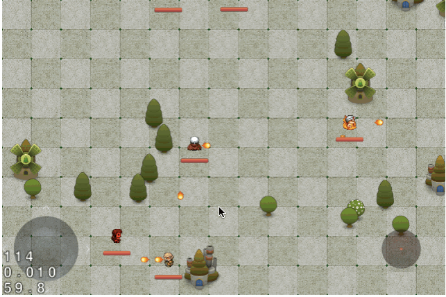

### SmallWorld-HTML5

[A live demo is here.](http://supersuraccoon.github.io/SmallWorld-HTML5)

A `Cocos2d-HTML5 v2.2.3` based mini game demo with the following features:

- Tiled Map Scrolling
- Hero Camera Follow
- Hero Moving Collsion Detection
- Bullet Collsion Detection
- Dynamic Z-Order
- Keyboard && Joypad Support
- Keyframe Animatin
